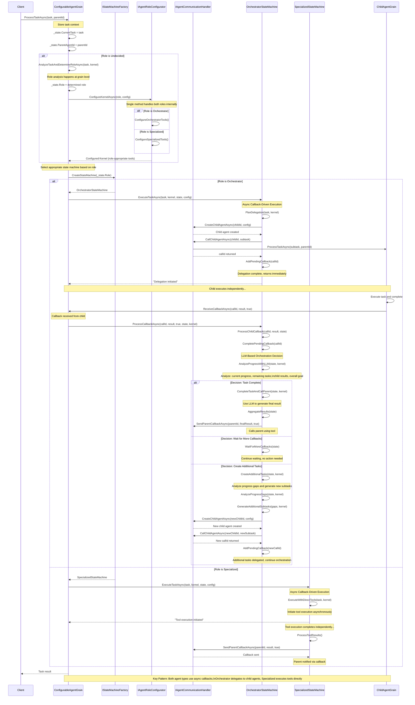
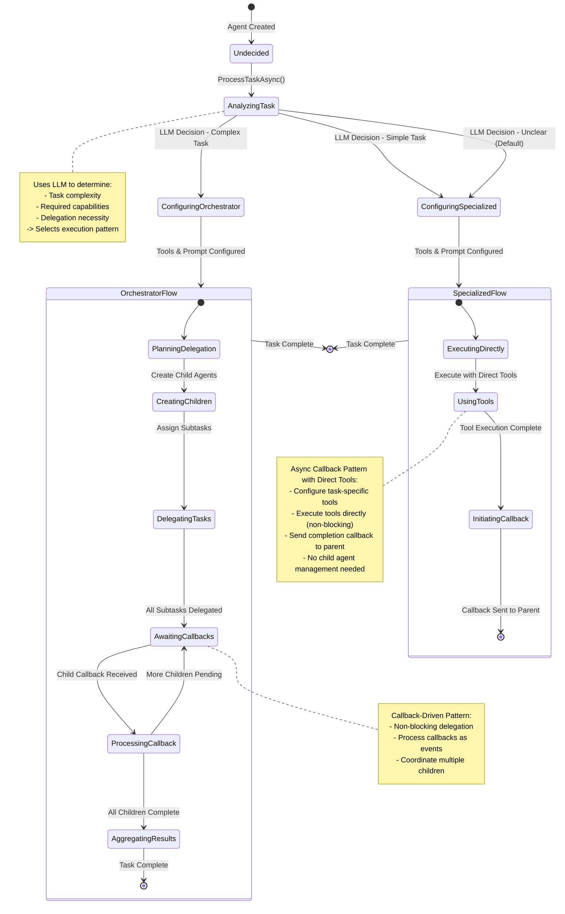
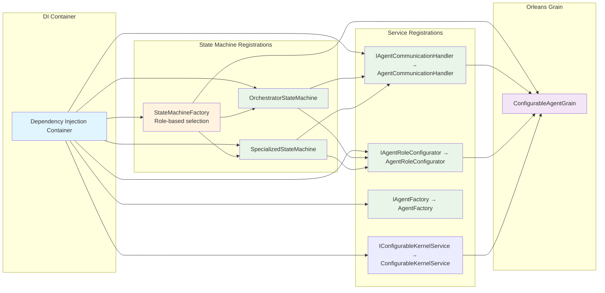
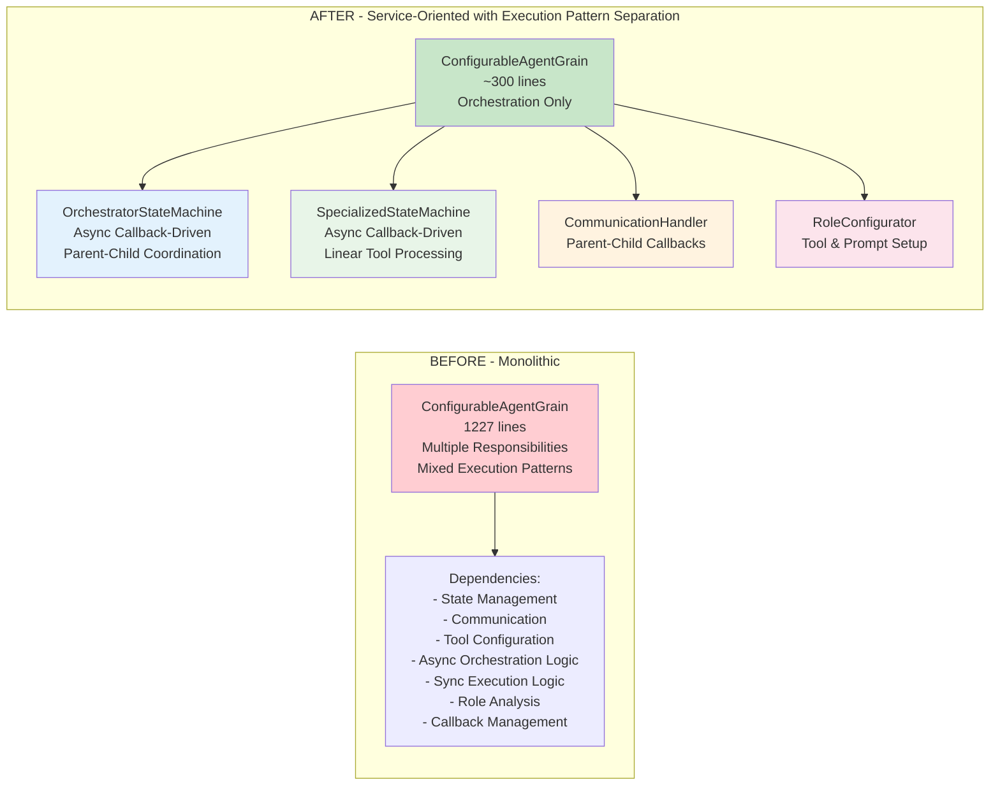

# PsiOrleans Refactoring Architecture - UML Diagrams & Design

## Overview

This document outlines a comprehensive refactoring strategy for the PsiOrleans codebase, transforming it from a monolithic structure into a clean, maintainable, service-oriented architecture while preserving the state machine functionality.

**Critical Architectural Insight**: Both agent types use asynchronous, callback-driven execution patterns. Orchestrator agents delegate to child agents and process callbacks as they arrive, while specialized agents execute tools directly but still use callbacks to notify parents asynchronously. This unified callback mechanism eliminates synchronous waiting patterns throughout the system, ensuring consistent non-blocking behavior.

## Current Issues

- **ConfigurableAgentGrain.cs**: 1227 lines violating Single Responsibility Principle
- **Legacy Code**: Unused AgentGrain, SemanticKernelService, and related files
- **Model Duplication**: AgentState and ConfigurableAgentState overlap
- **Tight Coupling**: Business logic mixed with infrastructure concerns
- **Poor Testability**: Monolithic structure makes unit testing difficult
- **Mixed Execution Patterns**: Inconsistent synchronous and asynchronous execution flows

## Refactoring Benefits

- ✅ **Reduced Complexity**: ConfigurableAgentGrain drops from 1227 lines to ~300 lines
- ✅ **Single Responsibility**: Each service has one clear purpose
- ✅ **Unified Callback Pattern**: Both agent types use consistent async callback mechanisms
- ✅ **Testability**: Individual services can be unit tested independently  
- ✅ **Maintainability**: Changes to state machine logic don't affect grain infrastructure
- ✅ **Reusability**: Services can be reused across different grain types
- ✅ **Performance**: Non-blocking execution patterns improve system responsiveness
- ✅ **Type Safety**: Value objects prevent invalid state mutations

---

## 🏗️ 1. CLASS DIAGRAM - Refactored Architecture

```mermaid
classDiagram
    %% Grain Layer
    class ConfigurableAgentGrain {
        -IStateMachineFactory stateMachineFactory
        -IAgentCommunicationHandler communicationHandler
        -IAgentRoleConfigurator roleConfigurator
        -IConfigurableKernelService kernelService
        -UnifiedAgentState state
        -Kernel kernel
        +ProcessTaskAsync(task, parentId) string
        +InitializeAsync(config, toolNames) bool
        +ReceiveCallbackAsync(callId, message, isSuccess) void
        +GetStateAsync() UnifiedAgentState
        +IsInitializedAsync() bool
        -AnalyzeTaskAndDetermineRoleAsync(task, kernel) AgentRole
    }

    class IConfigurableAgentGrain {
        <<interface>>
        +ProcessTaskAsync(task, parentId) string
        +InitializeAsync(config, toolNames) bool
        +GetStateAsync() UnifiedAgentState
        +IsInitializedAsync() bool
        +ReceiveCallbackAsync(callId, message, isSuccess) void
    }

    %% Service Layer Interfaces
    class IAgentStateMachine {
        <<interface>>
        +ExecuteTaskAsync(task, kernel, state, config) string
        +ProcessCallbackAsync(callId, message, isSuccess, state, kernel) void
    }

    class IAgentCommunicationHandler {
        <<interface>>
        +SendParentCallbackAsync(parentId, message, isSuccess) bool
        +CreateChildAgentAsync(agentId, config) bool
        +CallChildAgentAsync(childAgentId, task) string
        +HandleCallbackAsync(callId, message, isSuccess) void
    }

    class IAgentRoleConfigurator {
        <<interface>>
        +ConfigureKernelAsync(role, config) Kernel
        +GetSystemPromptForRole(role, originalPrompt) string
    }

    %% State Machine Implementations - Different execution patterns
    class OrchestratorStateMachine {
        -IAgentCommunicationHandler communicationHandler
        -IAgentRoleConfigurator roleConfigurator
        -CallbackManager callbackManager
        -ILogger logger
        +ExecuteTaskAsync(task, kernel, state, config) string
        +ProcessCallbackAsync(callId, message, isSuccess, state, kernel) void
        -ExecuteAsyncEventDriven(task, kernel, state) string
        -PlanDelegation(task, kernel) List~SubTask~
        -CreateChildAgents(subTasks) void
        -DelegateTasks(subTasks) void
        -ProcessChildCallback(callId, message, state) void
        -AnalyzeProgressWithLLM(state, kernel) OrchestrationDecision
        -ExecuteOrchestrationDecision(decision, state, kernel) void
        -CompleteTaskAndCallParent(state, kernel) void
        -WaitForMoreCallbacks(state) void
        -CreateAdditionalTasks(state, kernel) void
        -CheckAllCallbacksComplete(state) bool
        -AggregateResults(state) string
    }

    class SpecializedStateMachine {
        -IAgentCommunicationHandler communicationHandler
        -IAgentRoleConfigurator roleConfigurator
        -ILogger logger
        +ExecuteTaskAsync(task, kernel, state, config) string
        +ProcessCallbackAsync(callId, message, isSuccess, state, kernel) void
        -ExecuteSyncDirect(task, kernel, state) string
        -ExecuteWithDirectTools(task, kernel) string
        -SendCompletionCallback(parentId, result) void
    }

    %% Service Layer Implementations
    class AgentCommunicationHandler {
        -IClusterClient clusterClient
        -AgentCallbackManager callbackManager
        -AgentCreationService creationService
        -ILogger logger
        +SendParentCallbackAsync(parentId, message, isSuccess) bool
        +CreateChildAgentAsync(agentId, config) bool
        +CallChildAgentAsync(childAgentId, task) string
        +HandleCallbackAsync(callId, message, isSuccess) void
    }

    class AgentRoleConfigurator {
        -IConfigurableKernelService kernelService
        -ILogger logger
        +ConfigureKernelAsync(role, config) Kernel
        +GetSystemPromptForRole(role, originalPrompt) string
        -ConfigureOrchestratorTools(kernel, config) Kernel
        -ConfigureSpecializedTools(kernel, config) Kernel
    }

    %% Model Layer
    class UnifiedAgentState {
        +string AgentId
        +AgentRole Role
        +string CurrentTask
        +string ParentAgentId
        +List~string~ ChildAgentIds
        +Dictionary~string,CallbackData~ PendingCallbacks
        +AgentConfiguration Configuration
        +List~ChatMessage~ ChatHistory
        +List~CallableAgent~ CallableAgents
        +AgentMetrics Metrics
        +DateTime CreatedAt
        +DateTime LastUpdated
        +IncrementSuccessfulTasks() void
        +AddExecutionTime(timeSpan) void
        +AddPendingCallback(callId, data) void
        +CompletePendingCallback(callId) void
    }

    class AgentMetrics {
        <<value object>>
        +int TotalTasks
        +int SuccessfulTasks
        +int FailedTasks
        +TimeSpan TotalExecutionTime
        +IncrementSuccessful() AgentMetrics
        +IncrementFailed() AgentMetrics
    }

    class TaskExecutionContext {
        <<value object>>
        +string Task
        +string ParentId
        +AgentRole Role
        +DateTime StartTime
    }

    class AgentRole {
        <<enumeration>>
        Undecided
        Orchestrator
        Specialized
    }

    class OrchestrationDecision {
        <<enumeration>>
        CompleteTask
        WaitForMoreCallbacks
        CreateAdditionalTasks
    }

    %% Relationships
    ConfigurableAgentGrain --|> IConfigurableAgentGrain
    ConfigurableAgentGrain --> IStateMachineFactory
    ConfigurableAgentGrain --> IAgentCommunicationHandler
    ConfigurableAgentGrain --> IAgentRoleConfigurator
    ConfigurableAgentGrain --> UnifiedAgentState

    OrchestratorStateMachine --|> IAgentStateMachine
    SpecializedStateMachine --|> IAgentStateMachine
    AgentCommunicationHandler --|> IAgentCommunicationHandler
    AgentRoleConfigurator --|> IAgentRoleConfigurator

    OrchestratorStateMachine --> IAgentCommunicationHandler
    OrchestratorStateMachine --> IAgentRoleConfigurator
    SpecializedStateMachine --> IAgentCommunicationHandler
    SpecializedStateMachine --> IAgentRoleConfigurator

    UnifiedAgentState --> AgentMetrics
    UnifiedAgentState --> AgentRole
    TaskExecutionContext --> AgentRole

    note for OrchestratorStateMachine "Async Callback-Driven Execution:\n- Delegates to child agents\n- Processes callbacks as events\n- Non-blocking delegation\n- Coordinates complex workflows"
    note for SpecializedStateMachine "Async Callback-Driven Execution:\n- Executes tools directly\n- Sends completion callbacks\n- Non-blocking tool execution\n- No child agent management"
```



---

## 🔄 2. SEQUENCE DIAGRAM - ProcessTaskAsync Flow



---

## 📦 3. COMPONENT DIAGRAM - Layered Architecture

```mermaid
graph TB
    subgraph "Orleans Grain Layer"
        CG[ConfigurableAgentGrain]
        ICG[IConfigurableAgentGrain]
    end

    subgraph "Service Interface Layer"
        ISM[IAgentStateMachine]
        ICH[IAgentCommunicationHandler]
        IRC[IAgentRoleConfigurator]
        IAF[IAgentFactory]
    end

    subgraph "State Machine Implementation Layer"
        OSM[OrchestratorStateMachine<br/>Async Callback-Driven]
        SSM[SpecializedStateMachine<br/>Async Callback-Driven]
    end

    subgraph "Service Implementation Layer"
        CH[AgentCommunicationHandler]
        RC[AgentRoleConfigurator]
        AF[AgentFactory]
    end

    subgraph "Model Layer"
        UAS[UnifiedAgentState]
        AM[AgentMetrics]
        TEC[TaskExecutionContext]
        AR[AgentRole]
    end

    subgraph "Infrastructure Layer"
        KS[IConfigurableKernelService]
        CM[AgentCallbackManager]
        CS[AgentCreationService]
        CC[IClusterClient]
    end

    %% Dependencies
    CG --> ISM
    CG --> ICH
    CG --> IRC
    CG --> UAS

    OSM --> ICH
    OSM --> IRC
    SSM --> ICH
    SSM --> IRC
    CH --> CM
    CH --> CS
    CH --> CC
    RC --> KS

    UAS --> AM
    UAS --> AR
    TEC --> AR

    %% Interface implementations
    OSM -.-> ISM
    SSM -.-> ISM
    CH -.-> ICH
    RC -.-> IRC
    AF -.-> IAF
```



---

## 🔄 4. STATE DIAGRAM - Agent Role & Execution Transitions



---

## 🔧 5. DEPLOYMENT DIAGRAM - Service Registration



**StateMachineFactory Pattern**: The factory selects the appropriate state machine implementation based on AgentRole analysis:
- **OrchestratorStateMachine** for complex tasks requiring delegation
- **SpecializedStateMachine** for simple tasks requiring direct execution

---

## 📊 BENEFITS VISUALIZATION

### Before vs After Complexity:



---

## 🚀 IMPLEMENTATION ROADMAP

### Phase 1: Immediate Cleanup (1 day)
**Remove Legacy Files:**
```bash
# Safe to remove these legacy files completely:
rm src/Grains/AgentGrain.cs
rm src/Grains/IAgentGrain.cs  
rm src/Services/SemanticKernelService.cs
rm src/Services/ISemanticKernelService.cs
rm src/Models/AgentState.cs
rm src/Plugins/GDPSearchPlugin.cs
```

**Update Program.cs:**
```csharp
// Remove this line:
services.AddSingleton<ISemanticKernelService, SemanticKernelService>();
```

### Phase 2: Create State Machine Interfaces (2 days)

**Create Base State Machine Interface:**
```csharp
// src/Services/IAgentStateMachine.cs
public interface IAgentStateMachine
{
    Task<string> ExecuteTaskAsync(string task, Kernel kernel, UnifiedAgentState state, AgentConfiguration config);
    Task ProcessCallbackAsync(string callId, string message, bool isSuccess, UnifiedAgentState state, Kernel kernel);
}
```

### Phase 3: Implement Orchestrator State Machine (4 days)

**Create Orchestrator State Machine:**
```csharp
// src/Services/OrchestratorStateMachine.cs
public class OrchestratorStateMachine : IAgentStateMachine
{
    private readonly IAgentCommunicationHandler _communicationHandler;
    private readonly IAgentRoleConfigurator _roleConfigurator;
    private readonly CallbackManager _callbackManager;
    private readonly ILogger<OrchestratorStateMachine> _logger;

    public async Task<string> ExecuteTaskAsync(string task, Kernel kernel, UnifiedAgentState state, AgentConfiguration config)
    {
        // Async Callback-Driven Execution Pattern
        var subTasks = await PlanDelegation(task, kernel);
        await CreateChildAgents(subTasks);
        await DelegateTasks(subTasks);
        return "Delegation initiated"; // Returns immediately after delegation
    }

    public async Task ProcessCallbackAsync(string callId, string message, bool isSuccess, UnifiedAgentState state, Kernel kernel)
    {
        // Process incoming callback from child agent
        await ProcessChildCallback(callId, message, state);
        state.CompletePendingCallback(callId);
        
        // Use LLM to analyze current progress and decide next action
        var decision = await AnalyzeProgressWithLLM(state, kernel);
        await ExecuteOrchestrationDecision(decision, state, kernel);
    }

    private async Task<List<SubTask>> PlanDelegation(string task, Kernel kernel)
    {
        // Use LLM to break down task into subtasks
    }

    private async Task CreateChildAgents(List<SubTask> subTasks)
    {
        // Create child agents for each subtask
    }

    private async Task DelegateTasks(List<SubTask> subTasks)
    {
        // Delegate subtasks to child agents, store pending callbacks
    }

    private async Task ProcessChildCallback(string callId, string message, UnifiedAgentState state)
    {
        // Store child result and update state
    }

    private async Task<OrchestrationDecision> AnalyzeProgressWithLLM(UnifiedAgentState state, Kernel kernel)
    {
        // Use LLM to analyze:
        // - Current progress from all received callbacks
        // - Remaining pending callbacks
        // - Overall task completion status
        // - Need for additional subtasks
        // Returns: CompleteTask, WaitForMoreCallbacks, or CreateAdditionalTasks
    }

    private async Task ExecuteOrchestrationDecision(OrchestrationDecision decision, UnifiedAgentState state, Kernel kernel)
    {
        switch (decision)
        {
            case OrchestrationDecision.CompleteTask:
                await CompleteTaskAndCallParent(state, kernel);
                break;
            case OrchestrationDecision.WaitForMoreCallbacks:
                WaitForMoreCallbacks(state);
                break;
            case OrchestrationDecision.CreateAdditionalTasks:
                await CreateAdditionalTasks(state, kernel);
                break;
        }
    }

    private async Task CompleteTaskAndCallParent(UnifiedAgentState state, Kernel kernel)
    {
        // Use LLM to generate final result from all child responses
        var finalResult = await AggregateResultsWithLLM(state, kernel);
        
        // Call parent using tool (not direct method call)
        await kernel.InvokeAsync("SendParentCallback", new KernelArguments
        {
            ["parentId"] = state.ParentAgentId,
            ["result"] = finalResult,
            ["isSuccess"] = true
        });
    }

    private void WaitForMoreCallbacks(UnifiedAgentState state)
    {
        // Continue waiting - no action needed
        // State already updated with latest callback
    }

    private async Task CreateAdditionalTasks(UnifiedAgentState state, Kernel kernel)
    {
        // Essential feature: Generate additional subtasks based on progress analysis
        var progressGaps = await AnalyzeProgressGaps(state, kernel);
        
        if (progressGaps.Any())
        {
            var additionalSubTasks = await GenerateAdditionalSubtasks(progressGaps, kernel, state);
            
            foreach (var subTask in additionalSubTasks)
            {
                // Create new child agent for additional task
                var childAgentId = $"{state.AgentId}_additional_{Guid.NewGuid():N}";
                await _communicationHandler.CreateChildAgentAsync(childAgentId, subTask.Configuration);
                state.ChildAgentIds.Add(childAgentId);
                
                // Delegate the additional task
                var callId = await _communicationHandler.CallChildAgentAsync(childAgentId, subTask.Task);
                state.AddPendingCallback(callId, new CallbackData 
                { 
                    ChildAgentId = childAgentId, 
                    Task = subTask.Task,
                    CreatedAt = DateTime.UtcNow
                });
                
                _logger.LogInformation("Created additional task for agent {ChildId}: {Task}", 
                    childAgentId, subTask.Task);
            }
        }
    }

    private async Task<List<ProgressGap>> AnalyzeProgressGaps(UnifiedAgentState state, Kernel kernel)
    {
        // Use LLM to analyze completed results and identify what's missing
        var completedResults = state.PendingCallbacks.Values
            .Where(cb => cb.IsCompleted)
            .Select(cb => cb.Result)
            .ToList();

        var promptText = $@"
Analyze the following completed task results and the original task to identify any gaps or follow-up tasks needed:

Original Task: {state.CurrentTask}

Completed Results:
{string.Join("\n", completedResults.Select((r, i) => $"{i + 1}. {r}"))}

Identify any gaps, missing information, or follow-up tasks that would improve the overall result.
Return a JSON array of objects with 'description' and 'reasoning' fields for each gap found.
";

        var gapAnalysis = await kernel.InvokePromptAsync(promptText);
        return ParseProgressGaps(gapAnalysis.ToString());
    }

    private async Task<List<SubTask>> GenerateAdditionalSubtasks(List<ProgressGap> gaps, Kernel kernel, UnifiedAgentState state)
    {
        // Use LLM to convert progress gaps into actionable subtasks
        var gapsText = string.Join("\n", gaps.Select(g => $"- {g.Description}: {g.Reasoning}"));
        
        var promptText = $@"
Based on the following identified gaps in the task completion, generate specific subtasks to address them:

Original Task: {state.CurrentTask}
Identified Gaps:
{gapsText}

Generate specific, actionable subtasks that would address these gaps.
Return a JSON array of objects with 'task', 'priority', and 'estimatedComplexity' fields.
";

        var subtasksResponse = await kernel.InvokePromptAsync(promptText);
        return ParseAdditionalSubtasks(subtasksResponse.ToString());
    }

    private List<ProgressGap> ParseProgressGaps(string gapAnalysisJson)
    {
        // Parse the LLM response into ProgressGap objects
        // Implementation would use JSON parsing with error handling
        try
        {
            return JsonSerializer.Deserialize<List<ProgressGap>>(gapAnalysisJson) ?? new List<ProgressGap>();
        }
        catch (JsonException ex)
        {
            _logger.LogWarning("Failed to parse gap analysis JSON: {Error}", ex.Message);
            return new List<ProgressGap>();
        }
    }

    private List<SubTask> ParseAdditionalSubtasks(string subtasksJson)
    {
        // Parse the LLM response into SubTask objects
        // Implementation would use JSON parsing with error handling
        try
        {
            return JsonSerializer.Deserialize<List<SubTask>>(subtasksJson) ?? new List<SubTask>();
        }
        catch (JsonException ex)
        {
            _logger.LogWarning("Failed to parse additional subtasks JSON: {Error}", ex.Message);
            return new List<SubTask>();
        }
    }

    private async Task<string> AggregateResultsWithLLM(UnifiedAgentState state, Kernel kernel)
    {
        // Use LLM to intelligently combine all child results into coherent final result
        var allResults = state.PendingCallbacks.Values
            .Where(cb => cb.IsCompleted && cb.IsSuccess)
            .Select(cb => cb.Result)
            .ToList();

        var promptText = $@"
Aggregate the following task results into a coherent final response for the original task:

Original Task: {state.CurrentTask}

Child Results:
{string.Join("\n", allResults.Select((r, i) => $"{i + 1}. {r}"))}

Provide a comprehensive, well-structured final result that incorporates all relevant information.
";

        var aggregatedResult = await kernel.InvokePromptAsync(promptText);
        return aggregatedResult.ToString();
    }
}

// Additional Model Classes for CreateAdditionalTasks functionality
public class ProgressGap
{
    public string Description { get; set; } = string.Empty;
    public string Reasoning { get; set; } = string.Empty;
}

public class SubTask
{
    public string Task { get; set; } = string.Empty;
    public string Priority { get; set; } = string.Empty;
    public int EstimatedComplexity { get; set; }
    public AgentConfiguration Configuration { get; set; } = new();
}

public class CallbackData
{
    public string ChildAgentId { get; set; } = string.Empty;
    public string Task { get; set; } = string.Empty;
    public string Result { get; set; } = string.Empty;
    public bool IsCompleted { get; set; }
    public bool IsSuccess { get; set; }
    public DateTime CreatedAt { get; set; }
}
```

### Phase 4: Implement Specialized State Machine (3 days)

**Create Specialized State Machine:**
```csharp
// src/Services/SpecializedStateMachine.cs
public class SpecializedStateMachine : IAgentStateMachine
{
    private readonly IAgentCommunicationHandler _communicationHandler;
    private readonly IAgentRoleConfigurator _roleConfigurator;
    private readonly ILogger<SpecializedStateMachine> _logger;

    public async Task<string> ExecuteTaskAsync(string task, Kernel kernel, UnifiedAgentState state, AgentConfiguration config)
    {
        // Async Callback-Driven Execution Pattern
        // Execute tools and initiate callback to parent - no waiting
        _ = Task.Run(async () =>
        {
            try
            {
                var result = await ExecuteWithDirectTools(task, kernel);
                await SendCompletionCallback(state.ParentAgentId, result, kernel);
            }
            catch (Exception ex)
            {
                _logger.LogError(ex, "Error executing specialized task: {Task}", task);
                await SendCompletionCallback(state.ParentAgentId, $"Error: {ex.Message}", kernel, false);
            }
        });
        
        return "Tool execution initiated"; // Returns immediately after initiating execution
    }

    public async Task ProcessCallbackAsync(string callId, string message, bool isSuccess, UnifiedAgentState state, Kernel kernel)
    {
        // Specialized agents don't typically receive callbacks from children
        // This method can be empty or log unexpected callbacks
        _logger.LogWarning("Specialized agent received unexpected callback: {CallId}", callId);
    }

    private async Task<string> ExecuteWithDirectTools(string task, Kernel kernel)
    {
        // Direct tool execution without child agent delegation
        var result = await kernel.InvokePromptAsync($"Execute this task using available tools: {task}");
        return result.ToString();
    }

    private async Task SendCompletionCallback(string parentId, string result, Kernel kernel, bool isSuccess = true)
    {
        // Send completion callback to parent using tool
        if (!string.IsNullOrEmpty(parentId))
        {
            await kernel.InvokeAsync("SendParentCallback", new KernelArguments
            {
                ["parentId"] = parentId,
                ["result"] = result,
                ["isSuccess"] = isSuccess
            });
        }
    }
}
```

### Phase 5: Extract Role Configurator (2 days)

**Streamline Role Configurator:**
```csharp
// src/Services/IAgentRoleConfigurator.cs
public interface IAgentRoleConfigurator  
{
    Task<Kernel> ConfigureKernelAsync(AgentRole role, AgentConfiguration config);
    string GetSystemPromptForRole(AgentRole role, string originalPrompt);
}

// src/Services/AgentRoleConfigurator.cs
public class AgentRoleConfigurator : IAgentRoleConfigurator
{
    public async Task<Kernel> ConfigureKernelAsync(AgentRole role, AgentConfiguration config)
    {
        return role switch
        {
            AgentRole.Orchestrator => await ConfigureOrchestratorTools(kernel, config),
            AgentRole.Specialized => await ConfigureSpecializedTools(kernel, config),
            _ => kernel
        };
    }

    private async Task<Kernel> ConfigureOrchestratorTools(Kernel kernel, AgentConfiguration config)
    {
        // Add delegation tools: CreateAgent, CallChildAgent, SendParentCallback
    }

    private async Task<Kernel> ConfigureSpecializedTools(Kernel kernel, AgentConfiguration config)
    {
        // Add direct tools + SendParentCallback (no agent creation tools)
    }
}
```

### Phase 6: Create State Machine Factory (2 days)

**Implement Factory Pattern:**
```csharp
// src/Services/IStateMachineFactory.cs
public interface IStateMachineFactory
{
    IAgentStateMachine CreateStateMachine(AgentRole role);
}

// src/Services/StateMachineFactory.cs
public class StateMachineFactory : IStateMachineFactory
{
    private readonly IServiceProvider _serviceProvider;

    public IAgentStateMachine CreateStateMachine(AgentRole role)
    {
        return role switch
        {
            AgentRole.Orchestrator => _serviceProvider.GetRequiredService<OrchestratorStateMachine>(),
            AgentRole.Specialized => _serviceProvider.GetRequiredService<SpecializedStateMachine>(),
            _ => throw new ArgumentException($"Unsupported role: {role}")
        };
    }
}