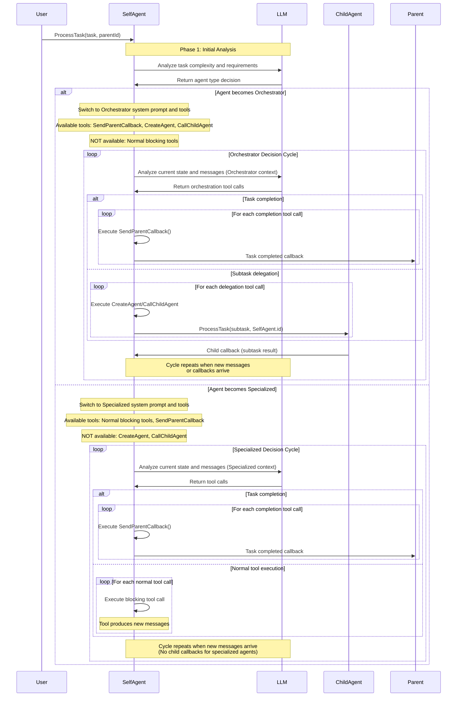

```mermaid
sequenceDiagram
    participant User as User
    participant SelfAgent as SelfAgent
    participant LLM as LLM
    participant ChildAgent as ChildAgent
    participant Parent as Parent

    User->>SelfAgent: ProcessTask(task, parentId)
    
    Note over SelfAgent,LLM: Phase 1: Initial Analysis
    SelfAgent->>LLM: Analyze task complexity and requirements
    LLM->>SelfAgent: Return agent type decision
    
    alt Agent becomes Orchestrator
        Note over SelfAgent: Switch to Orchestrator system prompt and tools
        Note over SelfAgent: Available tools: SendParentCallback, CreateAgent, CallChildAgent
        Note over SelfAgent: NOT available: Normal blocking tools
        
        loop Orchestrator Decision Cycle
            SelfAgent->>LLM: Analyze current state and messages (Orchestrator context)
            LLM->>SelfAgent: Return orchestration tool calls
            
            alt Task completion
                loop For each completion tool call
                    SelfAgent->>SelfAgent: Execute SendParentCallback()
                    SelfAgent->>Parent: Task completed callback
                end
                
            else Subtask delegation
                loop For each delegation tool call
                    SelfAgent->>SelfAgent: Execute CreateAgent/CallChildAgent
                    SelfAgent->>ChildAgent: ProcessTask(subtask, SelfAgent.id)
                end
            end
            
            ChildAgent->>SelfAgent: Child callback (subtask result)
            Note over SelfAgent,LLM: Cycle repeats when new messages<br/>or callbacks arrive
        end
        
    else Agent becomes Specialized
        Note over SelfAgent: Switch to Specialized system prompt and tools
        Note over SelfAgent: Available tools: Normal blocking tools, SendParentCallback
        Note over SelfAgent: NOT available: CreateAgent, CallChildAgent
        
        loop Specialized Decision Cycle
            SelfAgent->>LLM: Analyze current state and messages (Specialized context)
            LLM->>SelfAgent: Return tool calls
            
            alt Task completion
                loop For each completion tool call
                    SelfAgent->>SelfAgent: Execute SendParentCallback()
                    SelfAgent->>Parent: Task completed callback
                end
                
            else Normal tool execution
                loop For each normal tool call
                    SelfAgent->>SelfAgent: Execute blocking tool call
                    Note over SelfAgent: Tool produces new messages
                end
            end
            
            Note over SelfAgent,LLM: Cycle repeats when new messages arrive<br/>(No child callbacks for specialized agents)
        end
    end
```