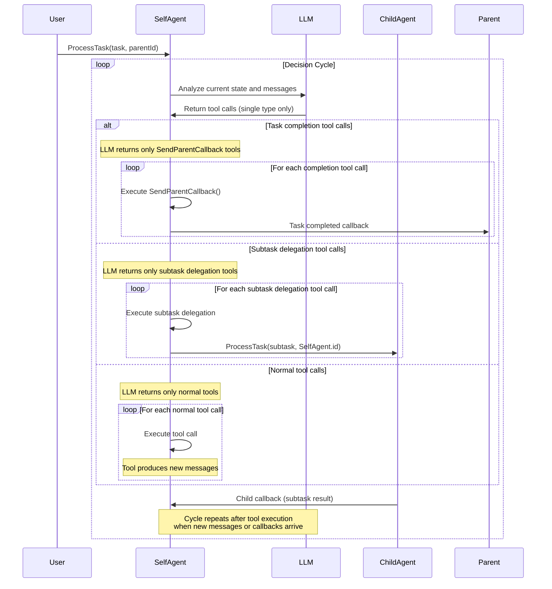

```mermaid
sequenceDiagram
    participant User as User
    participant SelfAgent as SelfAgent
    participant LLM as LLM
    participant ChildAgent as ChildAgent
    participant Parent as Parent

    User->>SelfAgent: ProcessTask(task, parentId)
    
    loop Decision Cycle
        SelfAgent->>LLM: Analyze current state and messages
        LLM->>SelfAgent: Return tool calls (single type only)
        
        alt Task completion tool calls
            Note over SelfAgent: LLM returns only SendParentCallback tools
            loop For each completion tool call
                SelfAgent->>SelfAgent: Execute SendParentCallback()
                SelfAgent->>Parent: Task completed callback
            end
            
        else Subtask delegation tool calls  
            Note over SelfAgent: LLM returns only subtask delegation tools
            loop For each subtask delegation tool call
                SelfAgent->>SelfAgent: Execute subtask delegation
                SelfAgent->>ChildAgent: ProcessTask(subtask, SelfAgent.id)
            end
            
        else Normal tool calls
            Note over SelfAgent: LLM returns only normal tools
            loop For each normal tool call
                SelfAgent->>SelfAgent: Execute tool call
                Note over SelfAgent: Tool produces new messages
            end
        end
        
        ChildAgent->>SelfAgent: Child callback (subtask result)
        
        Note over SelfAgent,LLM: Cycle repeats after tool execution<br/>when new messages or callbacks arrive
    end
```